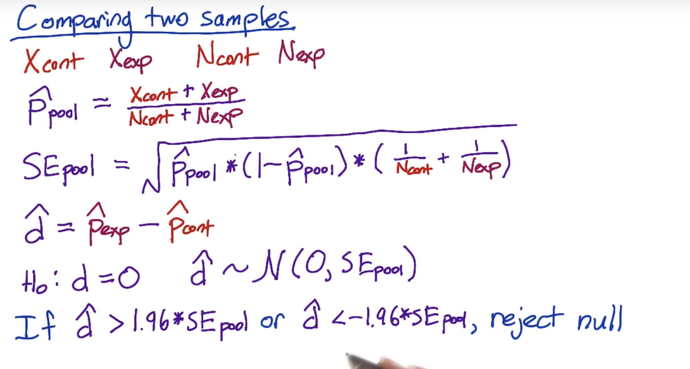
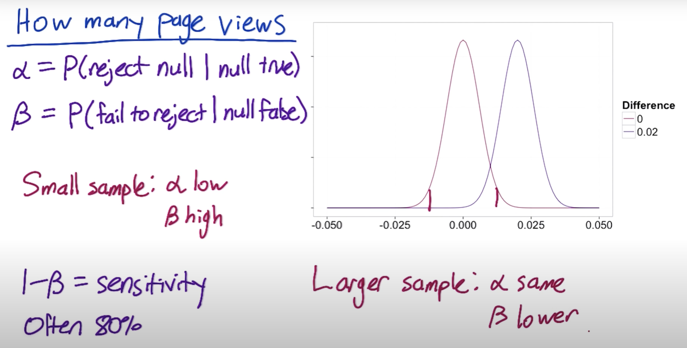
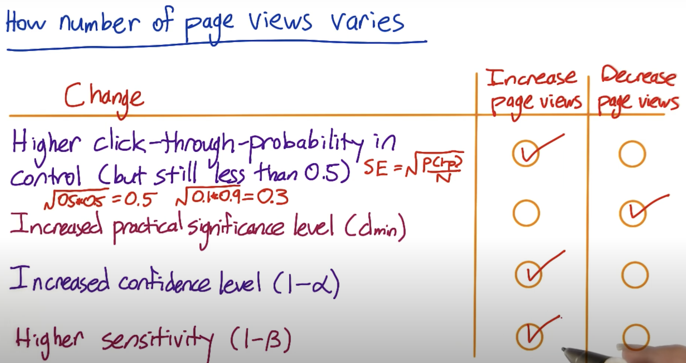
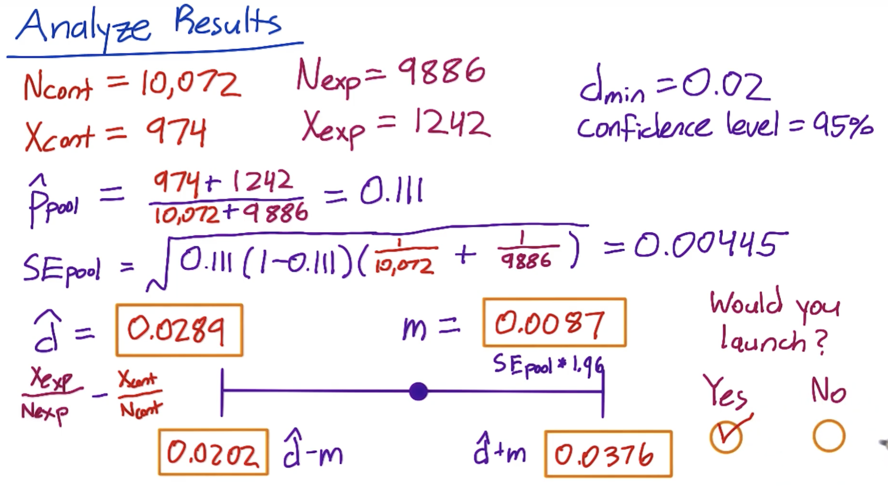
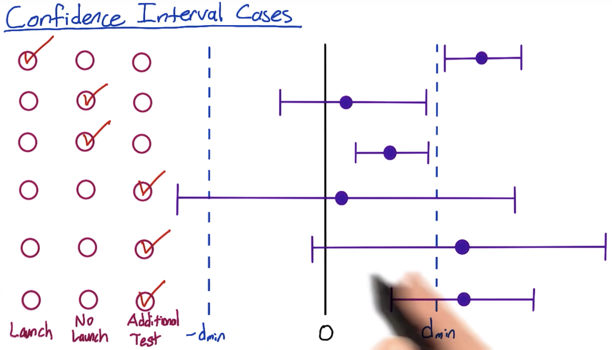

# A/B Testing udacity course learning notes

 

In below, ignore the "α low"

 

In below, the assumption is to hold all else equal.

Here "increased practical significance level" means we are no longer interested in detecting small changes. Larger changes are easier to detect, and require fewer page views.

 

In below, statistical significance 0.0202 is compared with the practical significance 0.02.

 

In below,

- Case 2
    - No statistically significant change from 0 since the confidence interval includes 0
    - Confident that there's not a practically significant change
- Case 3
    - Statistically significant. Confident that there was a positive change
    - Not practically significant. Confident that there was not a practically significant change
    - In other words, confident there is a change, but don't care about the magnitude of the change
- Case 4
    - The confidence interval bounds are outside of what's practically significant
- Case 5
    - The point estimate is beyond what's practically significant. This change is an effect you care about
    - But the confidence interval overlaps 0, so there might not be a change
- Case 6
    - Guess is that there is a practically significant positive change
    - But possible the change is not practically significant

