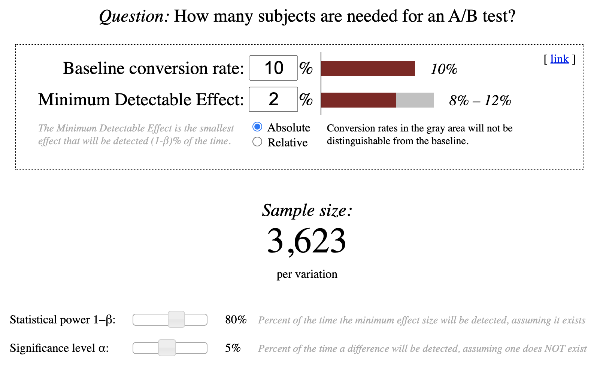

# A/B Testing udacity course learning notes

 

In below, ignore the "α low"

 

In below, the assumption is to hold all else equal.

Here "increased practical significance level" means we are no longer interested in detecting small changes. Larger changes are easier to detect, and require fewer page views.

 

In below, statistical significance 0.0202 is compared with the practical significance 0.02.

 

In below,

- Case 2
    - No statistically significant change from 0 since the confidence interval includes 0
    - Confident that there's not a practically significant change
- Case 3
    - Statistically significant. Confident that there was a positive change
    - Not practically significant. Confident that there was not a practically significant change
    - In other words, confident there is a change, but don't care about the magnitude of the change
- Case 4
    - The confidence interval bounds are outside of what's practically significant
- Case 5
    - The point estimate is beyond what's practically significant. This change is an effect you care about
    - But the confidence interval overlaps 0, so there might not be a change
- Case 6
    - Guess is that there is a practically significant positive change
    - But possible the change is not practically significant

 

Click metric definitions

- Def #1 (Cookie probability): For each `time interval`, number of cookies that click divided by number of cookies
- Def #2 (Pageview probability): For each `time interval`, number of pageviews with a click divided by number of pageviews
- Def #3 (Rate): Number of clicks divided by number of pageviews

 

- Percentiles are more useful than mean or median. Now we need to choose a percentile as the metric
- Take a few very similar population groups, and look at their, say, 75th percentiles. If the 75th percentiles vary a lot, then 75th percentiles is not robust enough.
- Take a few different population groups, and look at their, say, 75th percentiles. If the 75th percentiles do not vary much, then 75th percentiles is not sensitive enough.
- We need to choose a percentile that is both robust and sensitive

 

Bootstrapping

- From: https://youtu.be/O_Fj4q8lgmc
    - Why use Bootstrapping
        - When we do not have a large sample and cannot assume the sampling distribution is normal
        - When there isn't a formula to calculate the standard error of the estimate (e.g. 80th percentile)
    - Instead of calculating the standard error and then the confidence interval from formula, we can observe it from Bootstrapping
- Example usage: to construct a confidence interval for a non-normal distribution dataset. https://statisticsbyjim.com/hypothesis-testing/bootstrapping
- From: https://stats.stackexchange.com/questions/26088
    - Resampling is not done to provide an estimate of the population distribution -- we take our sample itself as a model of the population. Rather, resampling is done to provide an estimate of the sampling distribution of the sample statistic in question.
    - We usually have a hard time calculating the actual quantities of interest from that sample. So, we have to estimate them, and this is why we draw lots of bootstrap samples.
