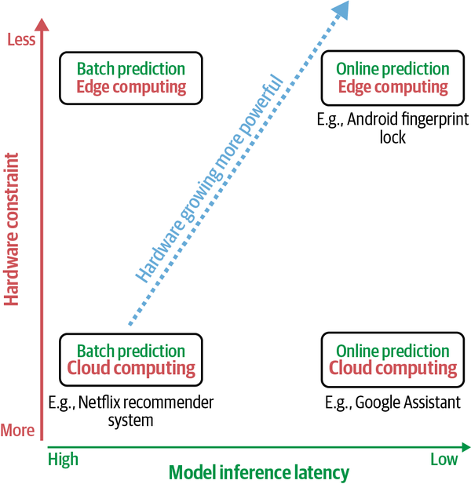
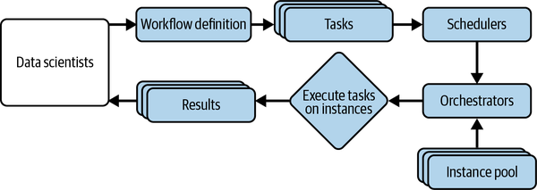

## Learning notes for the Designing Machine Learning Systems book

- Intermediate representation is needed for edge device, as it bridges framework (e.g. pytorch) and hardware (e.g. cpu, gpu, tpu)

- Compilers can optimize by looking at the computation graph of an ML model (convolution, loops, cross-entropy) and find a way to speed it up.  This process can take hours, even days for complex ML models. However, it’s a one-time operation, and the results of the optimization search can be cached and used to both optimize existing models and provide a starting point for future tuning sessions. 

- 

- Degenerate feedback loop: a system’s predictions influence how users interact with the system. E.g. (1) Recruiters only interview people whose resumes are recommended by the model (2) Recommender system: for products that are shown first, users click on them more. 
If it is a recommender system, we can add a positional feature to the training dataset to offset this problem.

- Shifting
    - Covariate shift: When P(X) changes, but P(Y|X) remains the same. E.g. have more age > 40 in the training data than in the inference data, but for age > 40, the probability of cancer is the same.
    - Label shift: When P(Y) changes but P(X|Y) remains the same. E.g. percentage of Positive is higher in training data, but if we randomly select person A with cancer from the training data and person B with cancer from the test data, A and B have the same probability of > 40.
    - Concept drift: When P(Y|X) changes but P(X) remains the same.

- We may bucket a feature, and hope any volatility will stay inside of buckets, although there is a trade-off between the performance (without buckets, features values are more granular) and the stability of a feature.

- If customers from some channels are more likely to have data distribution shifts, we may have a model dedicated for these customers, and have another model dedicated for the rest of customers, so that we can re-train one model more often, and the other model less often.

- Continual Learning is limited by the fresh data availability bottleneck, and the evaluation label availability bottleneck.

- Scheduler (e.g. Airflow), data, and model store (s3, Amazon SageMaker, Databricks’ Mlflow).

- Two key concepts in Docker are image and container. Running all the instructions in a Dockerfile gives you a Docker image. Run this Docker image will return a Docker container. Think of a Dockerfile as the recipe to construct a mold, which is a Docker image. From this mold, you can create multiple running instances; each is a Docker container. You can build a Docker image either from scratch, or from a base Docker image. You can install dependencies specific to your application on top of this base image. A tool to help manage (building, running, allocating resources for, and stopping) multiple containers is called container orchestration.

- To run both parts of the code on the same GPU instances, you will need GPU instances with high memory, which can be very expensive. Instead, you can run featurizing code on CPU instances and the model training code on GPU instances.

- If schedulers are concerned with when to run jobs and what resources are needed to run those jobs, orchestrators are concerned with where to get those resources. Schedulers deal with job-type abstractions such as DAGs, priority queues, user-level quotas (i.e., the maximum number of instances a user can use at a given time), etc. Orchestrators deal with lower-level abstractions like machines, instances, clusters, service-level grouping, replication, etc. If the orchestrator notices that there are more jobs than the pool of available instances, it can increase the number of instances in the available instance pool. We say that it “provisions” more computers to handle the workload. Schedulers are often used for periodical jobs, whereas orchestrators are often used for services where you have a long-running server that responds to requests. Many tools have a combined scheduler and orchestrator.

- After a workflow is defined, the tasks in this workflow are scheduled and orchestrated. See plot below:

- 

- A good workflow need to be:
    - Parameterized: Can pass parameters into the workflows (e.g. run the same model with different learning rates)
    - Dynamic: Can automatically create new steps at runtime as needed (e.g. when don’t know in advance how many records there are in the database)
    - Can specify the requirements for each step—required libraries, memory and compute requirements—and can automatically create a container with all these requirements to execute the step
    - For the same code, can switch between dev and prod (local and cloud) environments
