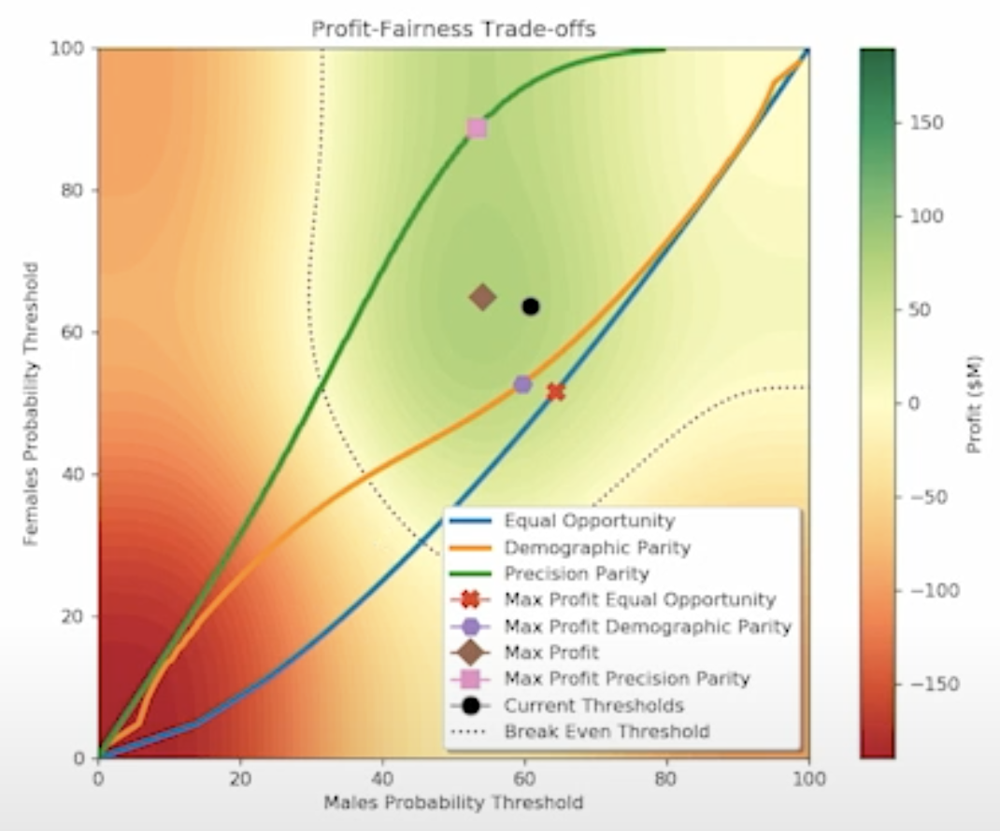

### From https://youtu.be/eLBVqqKF9MQ

### There is trade off. Need to pick a point.

### Can adjust the following to change the landscape.

### Summary of types of fairness, from https://fairware.cs.umass.edu/papers/Verma.pdf

### From: https://www.tensorflow.org/responsible_ai/model_remediation

Three ways to address bias concerns:

- Changing the input data: Collecting more data, generating synthetic data, adjusting the weights and sampling rates of different slices
- Intervening on the model: Changing the model itself by introducing or altering model objectives, adding constraints
- Post-processing the results: Modifying the outputs of the model or the interpretation of the outputs to improve performance across metrics
