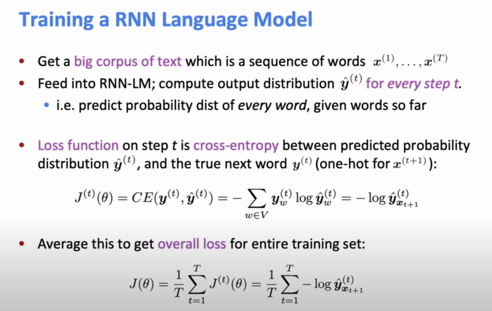
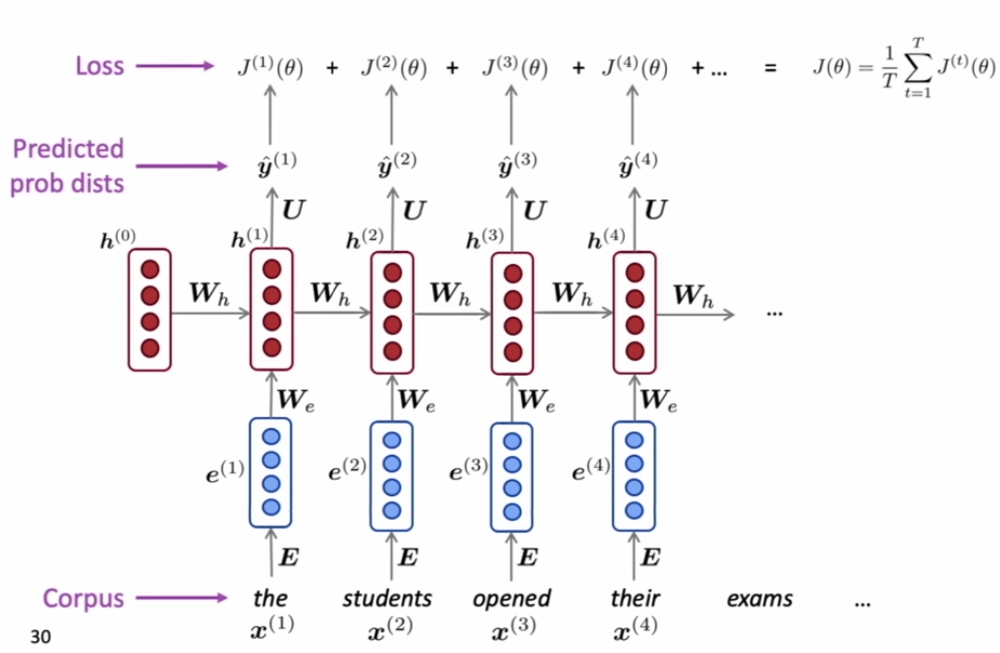

- Language Model is about predicting the next word.
- The core idea of RNN is that the same weight matrix is used in all steps.
- Compute loss J(θ) for a batch of sentenses, compute gradient and update weights. Repeat...

