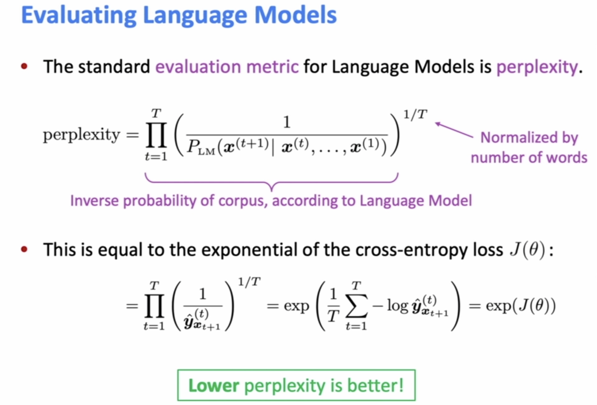
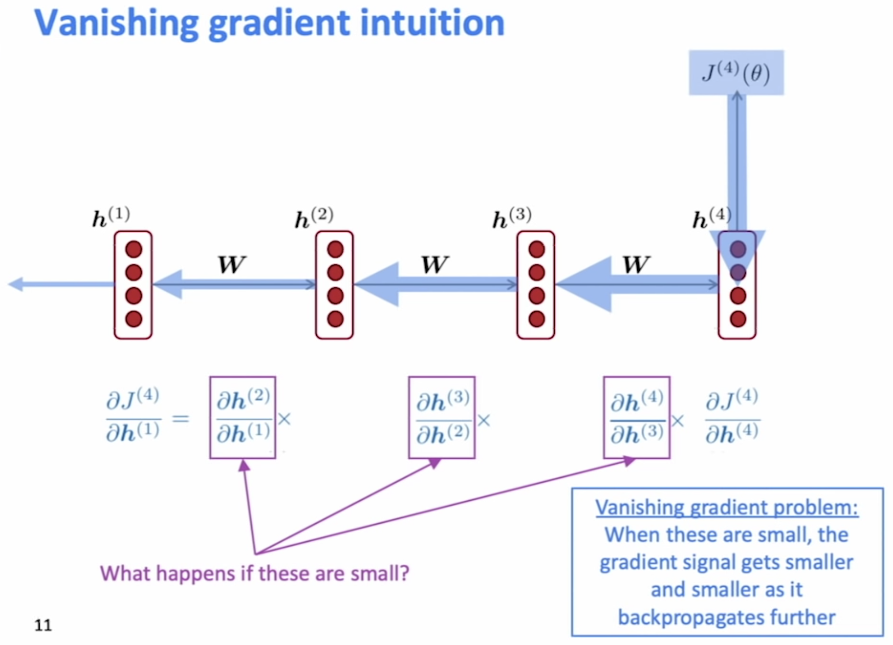
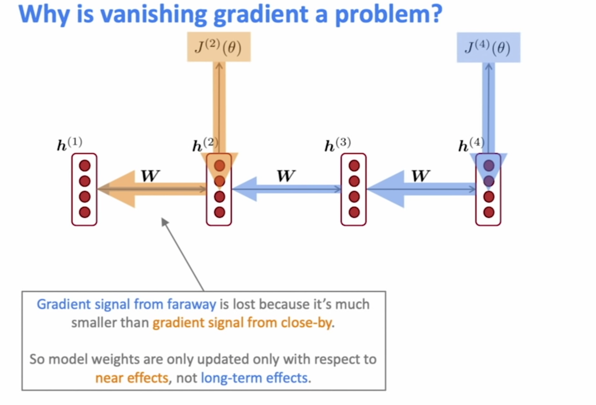
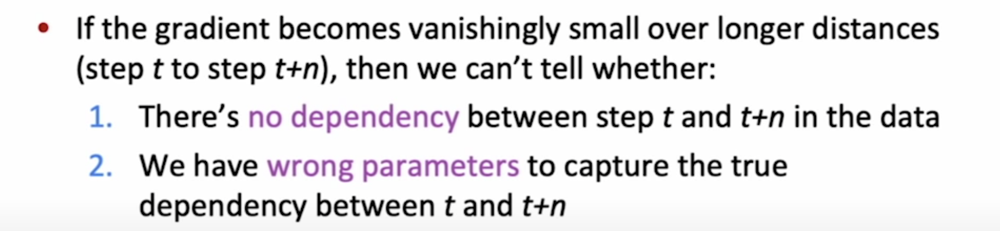
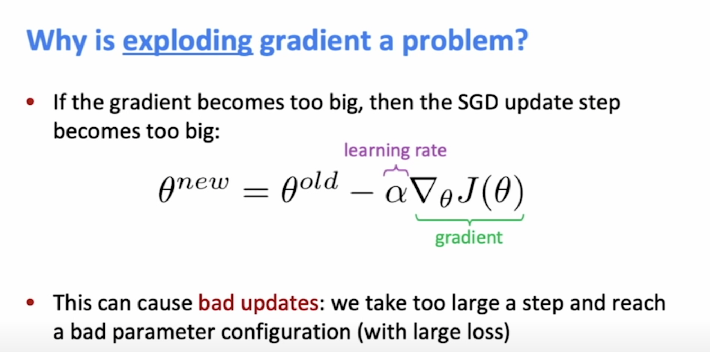
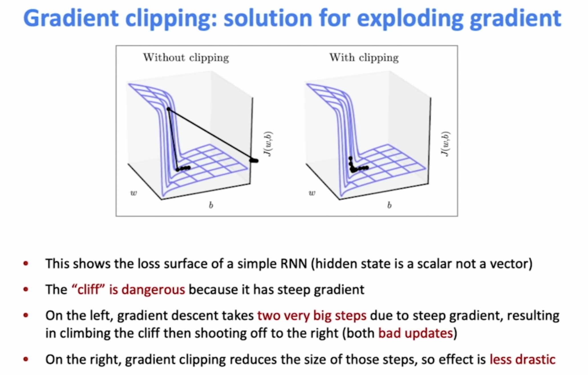
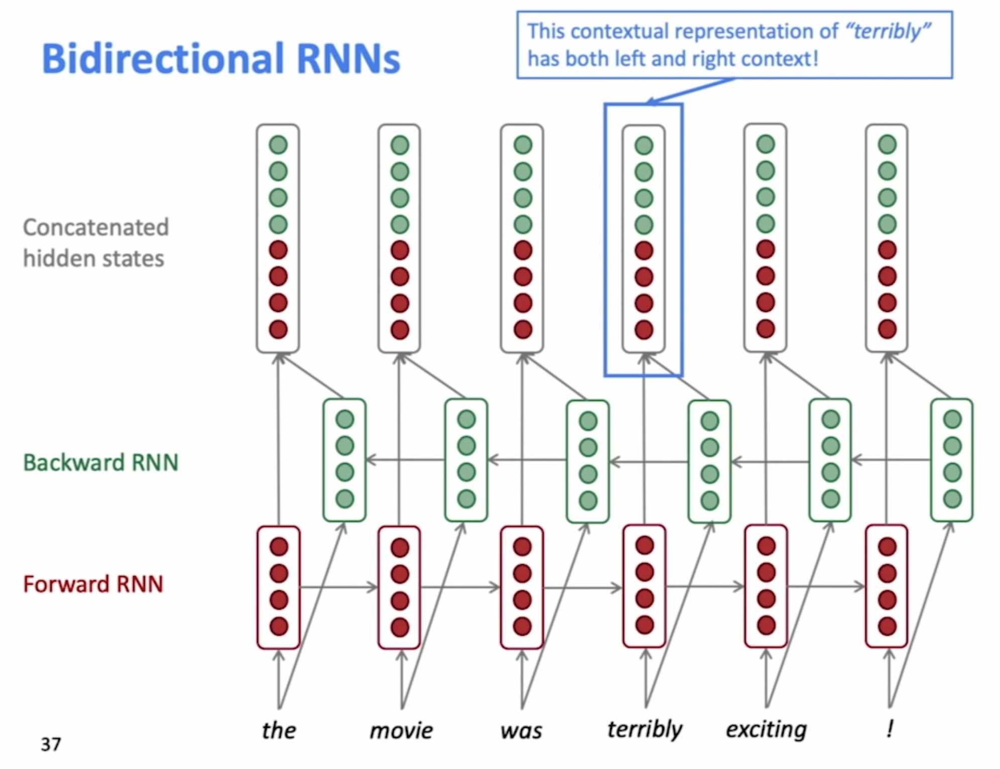
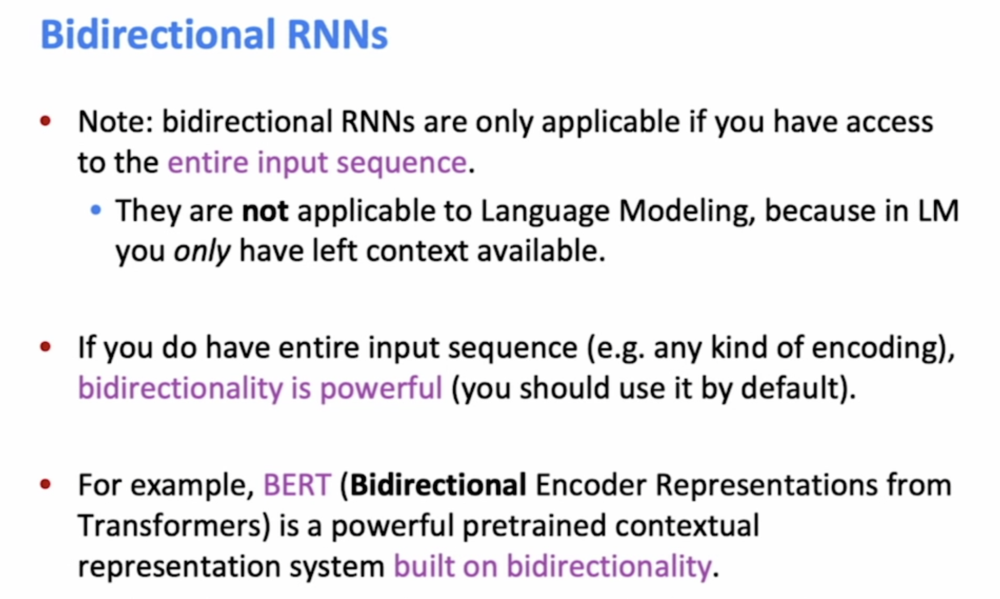

From: https://www.youtube.com/playlist?list=PLoROMvodv4rOhcuXMZkNm7j3fVwBBY42z

- Language Model is about predicting the next word. RNN is a way to build a Language Model.
- The core idea of RNN is that the same weight matrix is used in all steps.
- Compute loss J(θ) for a batch of sentenses, compute gradient and update weights. Repeat...

