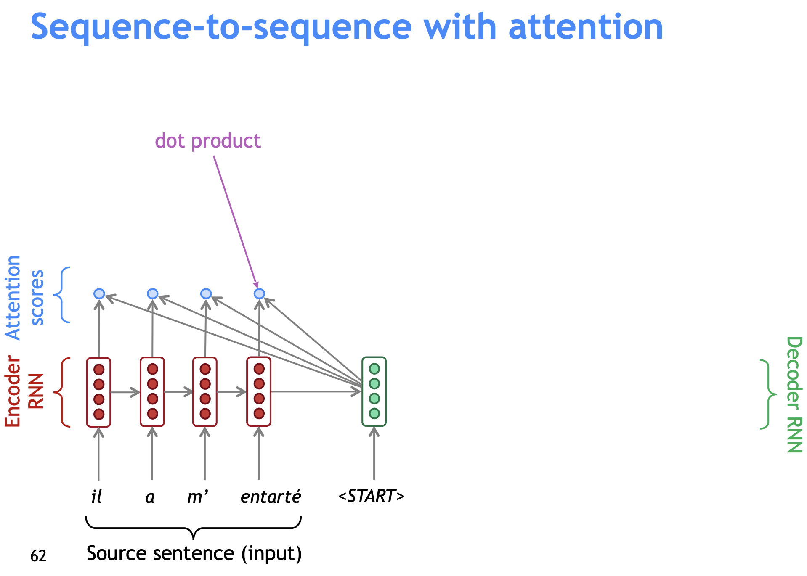
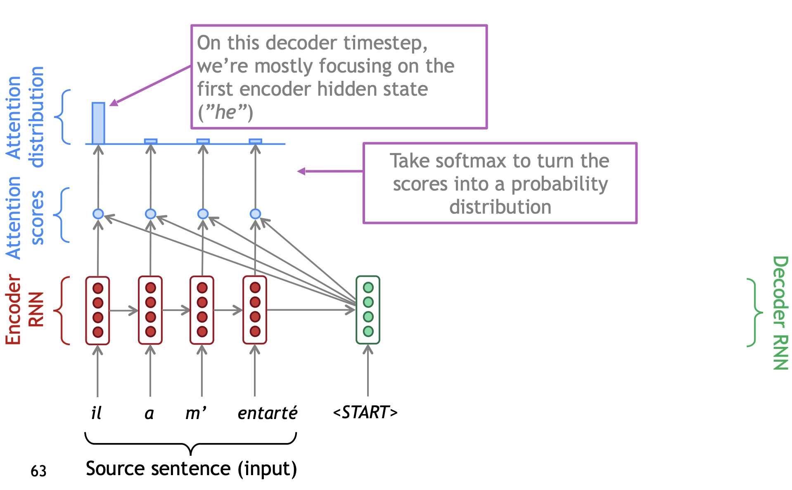
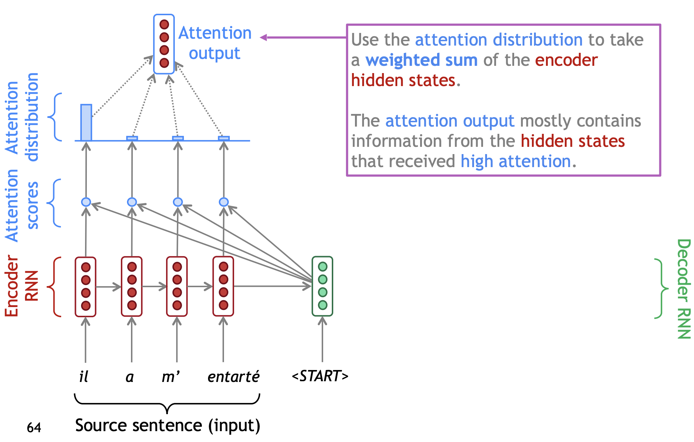
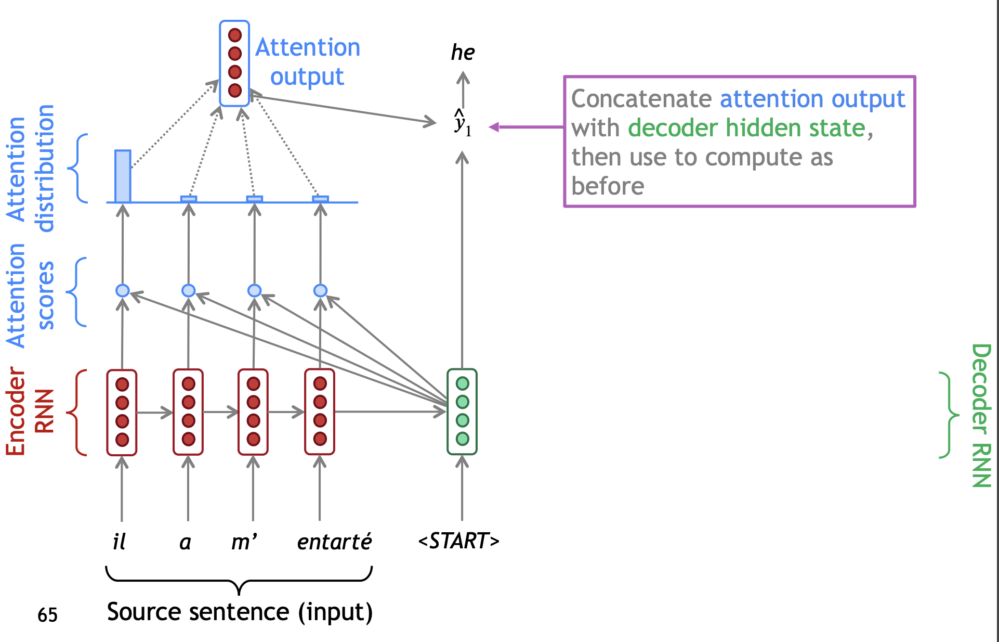
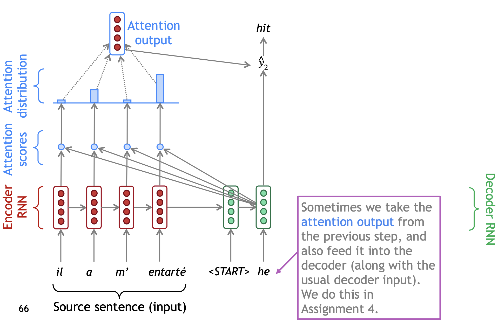
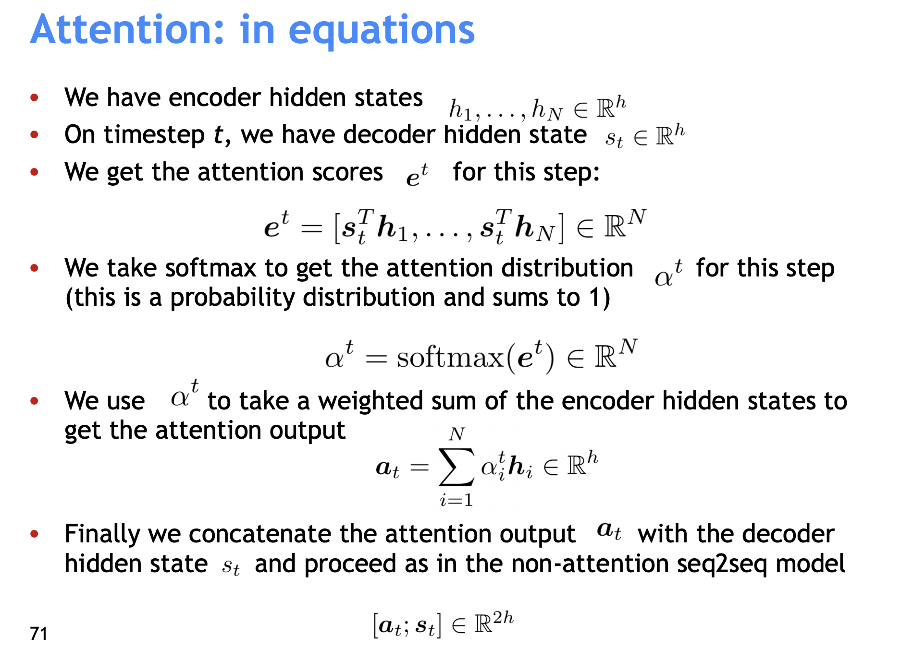
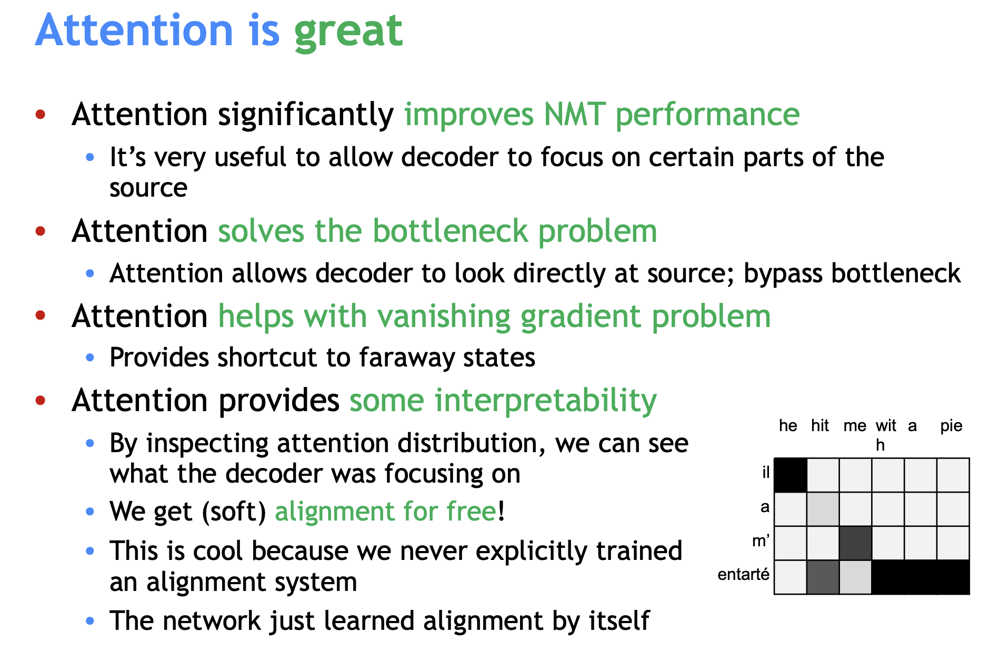

# Attention

From: 

- https://www.youtube.com/playlist?list=PLoROMvodv4rOhcuXMZkNm7j3fVwBBY42z
- http://web.stanford.edu/class/cs224n/slides/

In below, we pass the concatenated vector through a feedforward neural network (one trained jointly with the model).
The output of the feedforward neural networks indicates the output word of this time step.

"If attention gives us access to any state … maybe we don’t need the RNN?"

 
 
 
 

# Transformer

From:

- http://jalammar.github.io/illustrated-transformer/

Say the following sentence is an input sentence we want to translate:

”The animal didn't cross the street because it was too tired”

What does “it” in this sentence refer to? The street or to the animal?

As the model processes each word (each position in the input sequence), self-attention allows it to look at other positions in the input sequence for clues lead to a better encoding for this word. When the model is processing the word “it”, self-attention allows it to associate “it” with “animal”.

 
 

### How to calculate self-attention using vectors

The **first step** in calculating self-attention is to create three vectors from each of the encoder’s input vectors (in this case, the embedding of each word). So for each word, we create a Query vector, a Key vector, and a Value vector. These vectors are created by multiplying the embedding by three matrices that we trained during the training process. E.g. Multiplying x1 by the WQ weight matrix produces q1, the "query" vector associated with that word.

Notice that these new vectors are smaller in dimension than the embedding vector. Their dimensionality is 64, while the embedding and encoder input/output vectors have dimensionality of 512. They don’t HAVE to be smaller, this is an architecture choice to make the computation of multiheaded attention (mostly) constant.

The **second step** in calculating self-attention is to calculate scores. The scores determine how much focus to place on other parts of the input sentence as we encode a word at a certain position.

The score is calculated by taking the dot product of the query vector with the key vector of the respective word we’re scoring. So if we’re processing the self-attention for the word in position #1, the first score would be the dot product of q1 and k1. The second score would be the dot product of q1 and k2.

The **third and forth steps** are to divide the scores by 8 (the square root of the dimension of the key vectors used in the paper – 64. This leads to having more stable gradients. There could be other possible values here, but this is the default), then pass the result through a softmax operation. Softmax normalizes the scores so they’re all positive and add up to 1.

This softmax score determines how much each word will be expressed at this position. Clearly the word at this position will have the highest softmax score, but sometimes it’s useful to attend to another word that is relevant to the current word.

The **fifth step** is to multiply each value vector by the softmax score (in preparation to sum them up). The intuition here is to keep intact the values of the word(s) we want to focus on, and drown-out irrelevant words (by multiplying them by tiny numbers like 0.001, for example).

The **sixth step** is to sum up the weighted value vectors. This produces the output of the self-attention layer at this position (for the first word).

That concludes the self-attention calculation. The resulting vector is one we can send along to the feed-forward neural network.

However, in the actual implementation, this calculation is done in matrix form for faster processing. 

 
 

### How to calculate self-attention using matrices

The **first step** is to calculate the Query, Key, and Value matrices. We do that by packing our embeddings into a matrix X, and multiplying it by the weight matrices we’ve trained (WQ, WK, WV). 

Every row in the X matrix corresponds to a word in the input sentence. We again see the difference in size of the embedding vector (512, or 4 boxes in the figure), and the q/k/v vectors (64, or 3 boxes in the figure)

**Then**, since we’re dealing with matrices, we can condense steps two through six in one formula to calculate the outputs of the self-attention layer.

 
 

### Multi-headed self-attention

Two benefits:

1. It expands the model’s ability to focus on different positions. If there is only one head, it would contain a little bit of every other encoding, but it could be dominated by the the actual word itself.

2. It gives the attention layer multiple “representation subspaces”. With multi-headed attention, we have multiple sets of Query/Key/Value weight matrices (the Transformer uses eight attention heads, so we end up with eight sets for each encoder/decoder). Each of these sets is randomly initialized. Then, after training, each set is used to project the input embeddings (or vectors from lower encoders/decoders) into a different representation subspace. 

E.g. We multiply X by eight sets of WQ/WK/WV matrices to produce eight sets of Q/K/V matrices (which can be used to calculate eight sets of output matrices Z).

The feed-forward layer is not expecting eight matrices – it’s expecting a single matrix (a vector for each word). We concat the eight matrices, and then multiple them by an additional weights matrix WO. Now we have condensed these eight down into a single matrix.

All in one:

Now see where the different attention heads are focusing as we encode the word “it” in our example sentence:

If we have two attention heads, as we encode the word "it", one attention head is focusing most on "the animal", while the other is focusing on "tired".

If we have eight attention heads, things can be harder to interpret.

 
 

### Representing the order of the sequence using Positional Encoding

The transformer adds a vector to each input embedding, as a way to account for the order of the words in the input sequence.

If we assumed the embedding has a dimensionality of 4, the actual positional encodings would look like this:

 
 

### Adding residual connection and doing layer-normalization

Zoom in:

