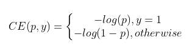
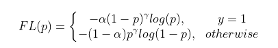
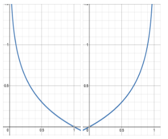
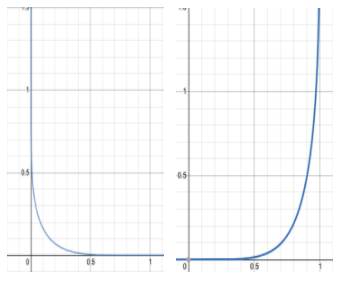

From:

- https://stats.stackexchange.com/questions/233658/softmax-vs-sigmoid-function-in-logistic-classifier
- https://stackoverflow.com/questions/53628622/loss-function-its-inputs-for-binary-classification-pytorch
- https://nathanbrixius.wordpress.com/2016/06/04/functions-i-have-known-logit-and-sigmoid/
- https://towardsdatascience.com/data-science-interview-deep-dive-cross-entropy-loss-b10355eb4ace

- `torch.nn.CrossEntropyLoss` includes a Softmax activation function.
    - From: https://pytorch.org/docs/stable/generated/torch.nn.CrossEntropyLoss.html and https://medium.com/deeplearningmadeeasy/negative-log-likelihood-6bd79b55d8b6
    - Summarized here: https://www.kaggle.com/kanruwang/understanding-crossentropyloss
    - `nn.CrossEntropyLoss()` combines `nn.LogSoftmax()` and `nn.NLLLoss(reduction="mean")` in one single class.
    - `nn.LogSoftmax()` first softmax and then take natural log as in https://pytorch.org/docs/stable/generated/torch.nn.LogSoftmax.html
    - For `nn.LogSoftmax()`, input shape is `[m samples, n classes]`, output shape is `[m samples, n classes]`.
    - Output of `nn.LogSoftmax()` are all negative numbers. For each sample, `nn.NLLLoss()` simply takes the correct class's value, and the negative of that value would be a positive value.
    - We minimize the negative log likelihood so that the probability of choosing the correct class is maximized.
    - For `nn.NLLLoss()`, input shape is `[m samples, n classes]` and `[m samples]`; output shape is `[m samples]` if the `reduction` argument is `"none"`, output is a scalar if the `reduction` argument is `"mean"`.
- `torch.nn.BCEWithLogitsLoss` includes a `Sigmoid` activation function.
- Sigmoid is used for binary classification; Softmax is used for multiclass classification.
- Sigmoid is used for multi-label classification (allow high probability for all of the classes, some of them, or none of them); Softmax is used for multiclass classification (mutually exclusive classes). See https://glassboxmedicine.com/2019/05/26/classification-sigmoid-vs-softmax/
- `torch.nn.BCELoss` needs a `Sigmoid` activation function but doesn't have one, so need to pass through a `Sigmoid` before `BCELoss`.

From:

- https://discuss.pytorch.org/t/how-to-use-bce-loss-and-crossentropyloss-correctly
- https://gombru.github.io/2018/05/23/cross_entropy_loss/
- https://www.programmersought.com/article/22191845241/

- For a binary classification, either use `nn.BCEWithLogitsLoss` and a single output unit, or `nn.CrossEntropyLoss` and two outputs.
- Usually `nn.CrossEntropyLoss` is used for a multi-class classification, but you could treat a binary classification as a (multi) 2-class classification
- Recommended to use passing raw logits to `BCEWithLogitsLoss`, as it will yield better numerical stability than `Sigmoid` + `nn.BCELoss`.

From:

- https://sebastianraschka.com/faq/docs/pytorch-crossentropy.html

- cross-entropy the same as the negative log likelihood
- `nn.functional.binary_cross_entropy_with_logits` takes logits as inputs
- `nn.functional.cross_entropy` takes logits as inputs
- `nn.functional.binary_cross_entropy` takes Sigmoid's output probabilities as inputs
- `nn.functional.nll_loss` takes LogSoftmax's logged probabilities as inputs
- `CrossEntropyLoss` = `Softmax (not LogSoftmax)` + `Cross-Entropy loss`
- `CrossEntropyLoss` = `LogSoftmax` + `NLLLoss` = `Softmax` + (`Log` + `NLLLoss`)
- `BCEWithLogitsLoss` = `Sigmoid` + `BCELoss`
- In fact, with the same probability inputs, `BCELoss` = `Log` + `NLLLoss`

 
 

### Focal loss

From:

- https://medium.com/visionwizard/understanding-focal-loss-a-quick-read-b914422913e7
- https://towardsdatascience.com/neural-networks-intuitions-3-focal-loss-for-dense-object-detection-paper-explanation-61bc0205114e

- I think α controls how much weight do we put on the positive class (meanwhile less weight on the negative class).
- In a imbalanced dataset, the number of well classified examples may be huge, and their contribution to the loss is huge. More the value of γ, more loss will be given to misclassified examples and less to well classified examples. A study mentioned γ = 2 gives the best results.

Cross entropy loss function

Focal loss loss function

Cross entropy loss vs probability

Focal loss loss vs probability, given α = 0.25 and γ = 4

 
 

### Label Smoothing

From: https://towardsdatascience.com/what-is-label-smoothing-108debd7ef06

- Smoothing parameter α = 0.1 is a good place to start
- Can try label smoothing, whenever a classification neural network suffers from overfitting and/or overconfidence
- Most popular non-deep learning methods do not use the softmax function. Thus label smoothing is usually not applicable.

From: https://towardsdatascience.com/label-smoothing-making-model-robust-to-incorrect-labels-2fae037ffbd0

- new_onehot_labels = onehot_labels * (1 - label_smoothing) + label_smoothing / num_classes
- If label_smoothing = 0.2, new_onehot_labels = [0 and 1] * (1 — 0.2) + 0.2 / 2 = [0.1 and 0.9], instead of [0 and 1]

See implementation: https://github.com/pytorch/pytorch/issues/7455

 
 

### How to explain validation loss is increasing while validation accuracy is increasing as well

From:

- https://stats.stackexchange.com/a/448033
- https://stats.stackexchange.com/a/341054

In cross-entropy loss, bad outlier predictions are penalized much more strongly than good predictions are rewarded.

