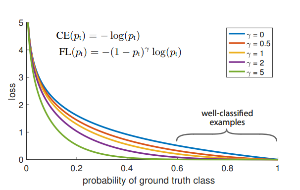

From:

- https://stackoverflow.com/questions/53628622/loss-function-its-inputs-for-binary-classification-pytorch
- https://nathanbrixius.wordpress.com/2016/06/04/functions-i-have-known-logit-and-sigmoid/

- torch.nn.CrossEntropyLoss includes a Softmax activation function.
- torch.nn.BCEWithLogitsLoss includes a Sigmoid activation function.
- torch.nn.BCELoss needs a Sigmoid activation function but doesn't have one, so need to pass through a Sigmoid before BCELoss.

### Focal loss

From:

- https://medium.com/visionwizard/understanding-focal-loss-a-quick-read-b914422913e7
- https://towardsdatascience.com/neural-networks-intuitions-3-focal-loss-for-dense-object-detection-paper-explanation-61bc0205114e

- I think α controls how much weight do we put on the positive class (meanwhile less weight on the negative class).
- In a imbalanced dataset, the number of well classified examples may be huge, and their contribution to the loss is huge. More the value of γ, more loss will be given to misclassified examples and less to well classified examples. A study mentioned γ = 2 gives the best results.

Cross entropy loss function

Focal loss loss function

Cross entropy loss vs probability

Focal loss loss vs probability, given α = 0.25 and γ = 4

