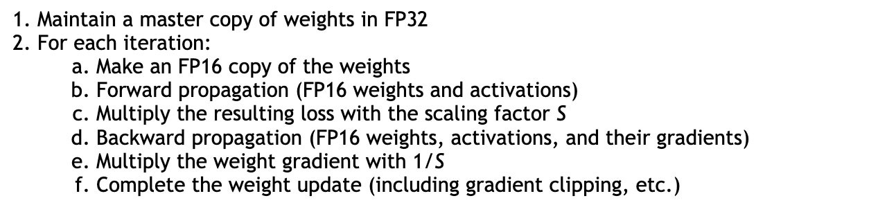

## Training

From: https://discuss.pytorch.org/t/what-step-backward-and-zero-grad-do/33301

- opt.zero_grad() clears old gradients from the last step (otherwise you’d just accumulate the gradients from all loss.backward() calls).
- loss.backward() computes the derivative of the loss w.r.t. the parameters (or anything requiring gradients) using backpropagation.
- opt.step() causes the optimizer to take a step based on the gradients of the parameters.
- The correct order is opt.zero_grad(), loss.backward(), opt.step().

From: https://www.jianshu.com/p/c59b75f1064c and https://discuss.pytorch.org/t/whats-the-difference-between-optimizer-zero-grad-vs-nn-module-zero-grad

- model.zero_grad() and optimizer.zero_grad() are the same if all your model parameters are in that optimizer. 
- It's safer to call model.zero_grad() to make sure all grads are zero, e.g. if you have two or more optimizers for one model.

From: https://discuss.pytorch.org/t/model-eval-vs-with-torch-no-grad/19615

- model.eval() will notify all your layers that you are in eval mode, so that batchnorm or dropout layers will work in the eval mode (which behave differently than in the training mode).
- model.eval() does not change any behavior of the gradient calculations.
- torch.no_grad() impacts the autograd engine and deactivate it. It will reduce memory usage and speed up computations but you won’t be able to backprop (which you don’t want in an eval script).
- torch.no_grad() does not disable dropout layers.
- After the `with torch.no_grad()` block was executed, your gradient behavior will be the same as before entering the block.
- Having model.eval() is enough to get valid results; having both model.eval() and torch.no_grad() will additionally save some memory.
- During eval mode, `Dropout` is deactivated and just passes its input (do not drop any activation).
- In more detail, during the training the probability `p` is used to drop activations. Also, the activations are scaled with `1./p` as otherwise the expected values would differ between training and eval.

        drop = nn.Dropout()
        x = torch.ones(1, 10)

        # Train mode (default after construction)
        drop.train()
        print(drop(x))

        # Eval mode
        drop.eval()
        print(drop(x))

- During eval mode, batchnorm should use saved running estimates instead of batch statistics.
- There is no such thing as “test mode”. Only train() and eval().
- torch.no_grad() and torch.set_grad_enabled(False) are the same.

## torch.optim.lr_scheduler.OneCycleLR

- From: https://pytorch.org/docs/stable/optim.html, total_steps = epochs * steps_per_epoch, so must either provide a value as argument for total_steps or provide a value for both epochs and steps_per_epoch.
- From: https://discuss.pytorch.org/t/cyclic-learning-rate-max-lr and https://stackoverflow.com/questions/62917353, max_lr in OneCycleLR should be larger than the lr in the optimizer.
- From: https://towardsdatascience.com/finding-good-learning-rate-and-the-one-cycle-policy-7159fe1db5d6
    - Answers why it is called one-cycle
    - The idea of "range test"
    - Use the highest batch size value that can be fit into memory to be used as batch size
- From: https://amarsaini.github.io/Optimizer-Benchmarks/
    - lr_scheudler wraps the optimizer and adjusts the optimizer's hyperparameters when lr_scheduler.step().
    - lr_scheduler needs to know the total number of steps beforehand, in order to adjust the lr appropriately between min_lr and max_lr.
- From: https://www.kaggle.com/kanruwang/optimizer-and-scheduler
    - The optimizer's originally specified lr will be overwritten by the scheduler
    - In a scheduler, `4 * max_lr / 100 = initial_lr = lr = min_lr * 10000`
    - When `max_lr` in a scheduler is specified, all other learning rate parameters will be automatically calculated and specified.
    - `lr` is the only learning rate parameter specified in an optimizer. It will be overwritten by an automatically calculated `lr` of a scheduler.
    - I believe when specifying `max_lr` for a OneCycleLR scheduler, with `4 * max_lr / 100 = initial_lr = lr = min_lr * 10000` in mind, we have this relationship:

            `initial_lr` or `lr` of the scheduler < the optimum `lr` of a standalone optimizer < `max_lr` of the scheduler

- OneCycleLR implementation example
    - https://www.deeplearningwizard.com/deep_learning/boosting_models_pytorch/lr_scheduling/
        - Need to run both `scheduler.step()` and `optimizer.step()`. The former adjusts the LR, the later updates the parameters via GD.
        - How LR is scheduled (per batch or per epoch) will determine whether `scheduler.step()` needs to be done for every batch or for every epoch.
    - https://stackoverflow.com/questions/59996859
        - For OneCycleLR, `scheduler.step()` need to be done for every batch, instead of for every epoch. This would explain why the following two are not really contradictory:
            - https://discuss.pytorch.org/t/how-to-adjust-learning-rate-according-to-batch-step-rather-than-epoch
            - https://discuss.pytorch.org/t/how-to-use-torch-optim-lr-scheduler-exponentiallr  
        - Use `optimizer.step()` before `scheduler.step()`
    - Others
        - https://zhuanlan.zhihu.com/p/136902153
        - https://discuss.pytorch.org/t/cyclic-learning-rate-max-lr
        - https://pytorch.org/docs/stable/optim.html
- print optimizer and scheduler learning rates the correct way
    - https://github.com/pytorch/pytorch/issues/31871
    
## Mixup, Cutmix, FMix

- https://medium.com/@virajbagal12/mixed-sample-data-augmentation-721e65093fcf
- https://medium.com/nerd-for-tech/cutmix-a-new-strategy-for-data-augmentation-bbc1c3d29aab

## Mixed Precision

- https://jonathan-hui.medium.com/mixed-precision-in-deep-learning-67f6dce3e0f3
    - Need less memory and also faster
    - 
    - The gradient in the backward pass can be too small and truncated to 0 in FP16 calculation
- https://zhuanlan.zhihu.com/p/165152789
    - pytorch's autocast + GradScaler will do the job
    - The `with autocast()` block (which casts the tensor to FP16) only needs to include the "forward" and "loss" calculation, but not the "backward" calculation, because the "backward" calculation will automatically use the same precision as the "forward" calculation
    - `GradScaler` scales up the loss to prevent gradient from being truncated to 0 (underflow), but if it scales the gradient too high, there will be overflow
    - `GradScaler` scales up the loss for the back propagation step, but then unscale the gradient before updating the weights
    - If there is overflow, the `GradScaler` will skip the current batch's weight update, and will also decrease the scaling effect
    - If there is no overflow for a few continuous batches, the `GradScaler` will increase the scaling effect
