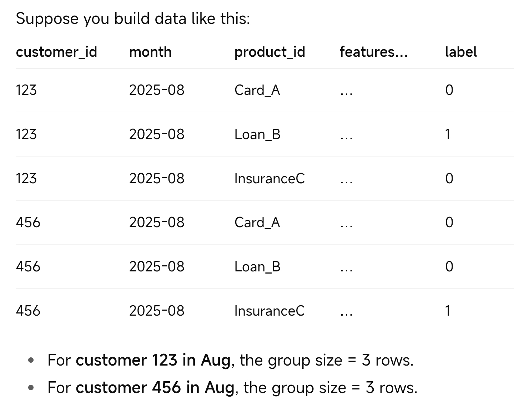

# Recommender System vs. Multiple Cross-selling/Upselling Propensity Models

This page discusses the feasibility of replacing mutiple (e.g. 30) separate cross-selling/upselling propensity models with one recommender system.

## Which recommender system

* The most suitable recommender system is **LambdaMART Learning-to-Rank Ranker**.
* It can (1) leverage the rich user-level features and (2) does not require feature pre-processing.
* It is commonly used by large tech companies as the last-stage result ranker before displaying results to customers.

 

## LambdaMART Ranker vs. 30 Propensity Models

### Pros

* **Transfer learning** can improve accuracy for rare products (highly imbalanced data).
* With 30 calibrated propensity models, it is possible that a customer’s Product A has the highest score (compared to Product B, C, etc.), but in fact Product B is preferred. LambdaMART Ranker mitigates this problem.
* LambdaMART Ranker is trained on **pairwise orderings**, so if any single product has bias (e.g., too many positive labels due to a SQL error), the bias would be mitigated.
* **Simplicity** of using one model.

### Cons

* To get the propensity of each product (only treat top customers), we need to add a complex calibration step that is modelled on both (X, y).
* Binary classification has simpler explainability.
* Operational concentration risk of using one model — for example, if product labels are noisy for Product P, it can slightly degrade shared trees that all products use.

 

## How to prepare data for LambdaMART Ranker

**Think in (query, documents, label):**

* **Query** = a specific customer at a time snapshot (e.g., end of month M). Group all examples for that customer-month together.
* **Documents** = the candidate products for that customer at that time.
* **Label** = what happened in the future window (Month+2 or Month+3).

### Labels, negatives, and sampling

* Build training pairs from many months: for each customer-month, include all eligible products as documents.
* Label the product the customer actually took in the next period as **1**, others **0**.
  * If they took nothing, all 0.
  * In this case, we do not have graded relevance (e.g., buy=2, view=1, not_view=0), but this is perfectly fine for the model training.
* If a customer already owns a product (or is ineligible) at a snapshot time, then:
  * **At training time:** That product shouldn’t be in the candidate set for that snapshot. Remove that row entirely from the training dataset.
  * **At serving / scoring time:** Apply the same rule — remove already-owned (or ineligible) product rows before calling `ranker.predict()`. The ranker only scores what’s possible.
  * No `group` argument is needed in inference; grouping is only for training.
* If a customer has not adopted any product at a snapshot time, then remove that group of rows from the training data.
* Keep all examples (best, if infrastructure allows), or down-sample easy negatives per query (e.g., keep all positives, sample up to N negatives per customer-month).

### What is qid / group?

* In a LambdaMART ranker, training is done within **groups**.
  A group = a query = a specific customer at a specific snapshot in time
  (e.g., “Customer 123 as of 2025-09, considering products A–Z”).
  All rows for `(customer_id = 123, snapshot_month = 2025-09)` are one group.
  The **qid** is the group identifier that tells LightGBM to
  “compare these rows against each other when computing pairwise/listwise loss.”

* In **LightGBM Python**, do **not** pass the IDs directly.
  Instead, pass the **group sizes** (number of rows per qid) in the same order as the training data.
  The training data must be sorted so that all rows of a group (one customer-month snapshot) are contiguous.
  Then pass `[len(group1), len(group2), len(group3), ...]` in exactly that same order.

  Sort training data by `(customer_id, snapshot_month)` before splitting off labels/features.
  Then compute group sizes from that sorted dataset and pass those group sizes to LightGBM.

 

## If SQL for one product is wrong, will other products suffer?

Yes, a bit — but mostly contained.
Label noise for Product P harms pairs where P is compared to others for the same customer.
Because trees are shared, some splits may shift slightly and affect other products.
Need to monitor per-product **NDCG/Recall**.

 

## The necessity to calibrate a LambdaMART Ranker

* Just like binary classification, calibration is needed for scores to be comparable across customers.
* The model is trained to produce scores primarily to optimize ordering within each query (customer-month), **not** to approximate a probability.
* The ranking objective is **translation-invariant** (i.e., adding a constant or scaling all scores in a group doesn’t change the ordering).
  That means two different absolute score ranges but preserved ordering are equally good with respect to ranking.
* Consequently, the same raw score value might mean different things in different groups (customers, months) depending on that group’s context.
* Thus, a naive calibration using only the scores may not suffice — we may need both features and scores (X, y) for calibration.

 

## How to calibrate a LambdaMART Ranker

* Calibrate per product.
* Use a **gradient boost tree classifier** (or a **logistic regression classifier**) with monotonic constraints.
* Use ground truth, scores, and features for calibration.

 

## Key evaluation metrics for a LambdaMART Ranker

* **Recall@Top1 / Precision@Top1** — exclude customers with no positives from the metric’s denominator.
* After calibration, use our common metrics (e.g., **Precision@top x%** for a certain product, **AUC**, etc.).
* Need to monitor **calibration drift**.

 

## Why do we not use a multi-label gradient boost tree instead?

* Just like a LambdaMART Ranker, a multi-label model can also benefit from transfer learning, which can improve accuracy for rare products.
* However, it cannot properly handle **ineligible (or already owned)** products.
