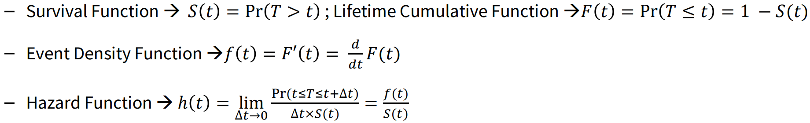
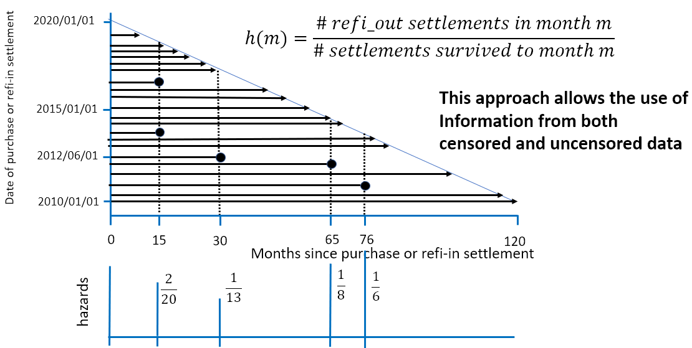
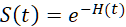
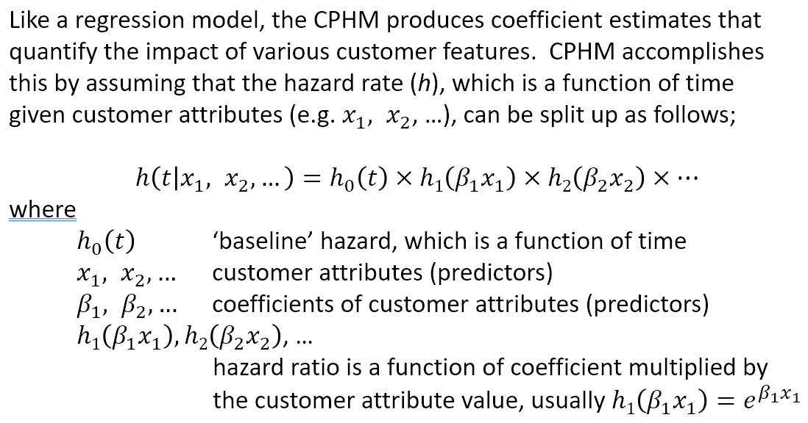
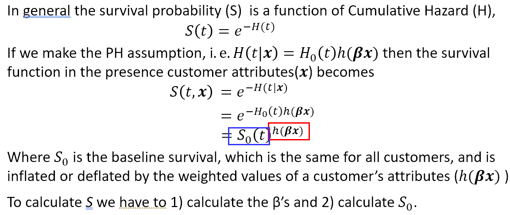

# Survival Analysis

## Concept

#### Survival Analysis Benefits
- https://medium.com/dataminingapps-articles/using-survival-analysis-to-model-time-to-default-f918e6d5ff36

#### Censoring and Truncation
- https://youtu.be/K-_sblQZ5rE

#### Hazard and Survival Functions
- https://youtu.be/zAdF8WSyfsA

#### Hazard Function / Hazard Rate (h)

- In the example of the home loan customer refinance-out event:

- Hazard Function can tell us when the event risk is greatest in the life of a customer.

#### Cumulative Hazard (H)

- Hazard can be accumulated over time to become the Cumulative (or Integrated) Hazard (H).
- For example, if the hazard rate is constant with a value of 𝑥 per day then after a week the cumulative hazard would be 7𝑥. 
- This is important because the survival probability (S) is a function of H: 
- S(t) is the probability that survival exceeds t.

 

## Two Main Types of Survival Model 

- Accelerated Failure Time (AFT) model – customer information models the survival time t, i.e. some customer tenures will "age" faster than others.
- Cox Proportional Hazards (CPH) model – customer information models the Hazard Rate. The baseline hazard function varies over time but is the same for all customers; the Hazard Rate ratio between two customers is constant over time. E.g. a certain type of customers are 3 times more likely to churn than another type of customers.

### Cox Proportional Hazards Model (a.k.a. CPHM) (Semi-Parametric Model, models the hazard/risk)
- CPHM's Hazard Function / Hazard Rate (h) and why it is proportional
  - 
  - 
- Fitting Cox Proportional Hazards Model
  - If the hazard function / hazard rate has a sharp peak (e.g. many new customers tend to leave at about 12 months after joining), we should use CPHM because it does not assume a particular distribution for survival times; we should not use Accelerated Failure Time model because it assumes a particular distribution for the survival time (e.g. Weibull, log-normal, exponential) which does not accommodate the peak.
  - If we can find out a dimension from which we can separate the customer base into multiple groups whose estimated Hazard Rate (Hazard Function) vs. Time axis does not obey the proportional hazards assumption (i.e. each line should be a proportional scaling up or down of other lines), then we need to split customers into these groups and model them separately.
  - During training, we estimate the values of all β, and then estimate the baseline survival function 𝑆0(𝑡).
  - During inference, we plug in each customer's value of x.
  - Target customers when the predicted survival falls below e.g. 0.50. For a customer, the fewer historical months the customer lived before crossing the 0.5 threshold, the more endangered.
- More Concepts
  - https://medium.com/utility-machine-learning/survival-analysis-part-1-the-weibull-model-5c2552c4356f
  - https://medium.com/utility-machine-learning/survival-analysis-part-2-taking-advantage-of-static-data-28acd09fa2d4
  - First half of: https://youtu.be/W9_V-TTOCPM and https://youtu.be/JUaZK9TchCU
    - A positive coefficient of a variable means that the higher the variable the higher the risk

### Accelerated Failure Time (Parametric Model, models the time-to-event)
- https://xgboost.readthedocs.io/en/stable/tutorials/aft_survival_analysis.html
  - Express the labels in the form of a range, so that every data point has two numbers associated with it, namely the lower and upper bounds for the label. For uncensored labels, use a degenerate interval of form `[a, a]`.
- First half of: https://youtu.be/Mfq8vWOGTQo and https://youtu.be/JUaZK9TchCU
  - A positive coefficient of a variable means that the higher the variable the lower the risk.
- https://lifelines.readthedocs.io/en/latest/Survival%20Regression.html#accelerated-failure-time-models
  - Unlike XGBoost, no need to specify the lower and upper bounds for the label, due to its input data format different from XGBoost's.
- First half of: https://myweb.uiowa.edu/pbreheny/7210/f15/notes/10-15.pdf
  - Whereas in a proportional hazards (PH) model, the covariates act multiplicatively on the hazard, in an AFT model the covariates act multiplicatively on time.

 

## Two Ways of Forming Training Data

### Dynamic Start Date (a.k.a. Rolling Entry Cohort) method
- The training dataset includes customers who became customers between Start Date and Censor Date.
- Choose attributes at the Start Date (𝑡 = 0)
  - If Duration is measured from when each customer starts to exist, until its Event (or Censor) Date, we would not have window features.
  - Alternatively, if given source data is available from time `t` and window features take a span of `s`, we model all customers that already have a history of `s` at the time `t + s`, we would have window features. In production, we would not be able to apply this model to relatively new customers who have a tenure <= `s`.
  - Alternatively, Start Date is a randomly chosen month between 1 to n before the Event (or Censor) date. Probability mass function of Event customers is used to randomly generate Censor Dates for non-event customers, so that (1) observation periods for Event and Non-event samples are consistent, (2) the test set can be naturally created. Furthermore, window features are available for modeling.
- In theory, during inference a trained Dynamic Start Date model can only score customers who originate between Start Date and Censor Date. But in practice, the model is applied to customers originate after Censor Date; we assume that the hazard rate is only affected by each customer's "internal clock" and is not affected by environment changes (e.g. interest rate changes).
- If we have very long tenure customers, we may not have recorded all their features at Start Date; their features at Start Date may also be too outdated and therefore not representative of their current situation.
- Has fewer customer Selection Biases (compared to Fixed Start Date method) because customers joined at different times are all included; the model captures a broader range of behaviour.
- Has potential Temporal Bias. When customers join at different time, significant changes in economic conditions or marketing campaigns can happen.
- Allows including relatively new customers in the training set, compared to Fixed Start Date method.

### Fixed Start Date method
- Measure all customers' attributes on Start Date.
- All customers in the training dataset joined the company before Start Date; this is Selection Bias. Customers who have short lifespans (or customers who joined the company after Start Date) are not included in the training dataset; this is Survivorship Bias.
- In theory, during inference, a trained Fixed Start Date model should not be applied to customers who originate after Start Date. In practice, the model is applied to customers originate after Start Date; we assume that the hazard rate is only affected by each customer's "internal clock" and is not affected by environment changes (e.g. interest rate changes).
- Low potential Temporal Bias. Because all customers are first observed at the same date, the impact of significant changes (in economic conditions or marketing campaigns between Start Date and Censor Date) are just the same offset for all customers, and the impact of individual's conditions can be accurately measured.
- The assumption is that the hazard is constant in time (the survival function decays exponentially). The period needs to be long enough to capture enough events to build a reasonable model while short enough so the hazard remains constant.
- Can have a feature that indicates how long have they existed before Start Date.

 

## Applications

- When we pre-process the data for model training, we only need to calculate a Duration column and an Event_vs_Censor (binary) column; the python package (lifelines / XGBoost) can handle the rest.
- There is a dilemma between (1) having a long censoring period (more accurate estimates) and (2) applying the trained model to a large customer base; because after a long censoring period many customers already experienced the event.
- How to apply model to customers joined after the censor date?
  - Re-train the model with more recent data.
  - Use a classification propensity model to handle new customers.
- Prioritize contacting customers whose predicted survival falls below a certain threshold.
- Additionally, customer lifetime value can be calculated by combining expected survival times with monthly revenues.
